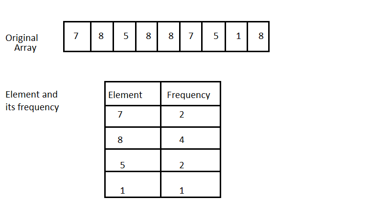
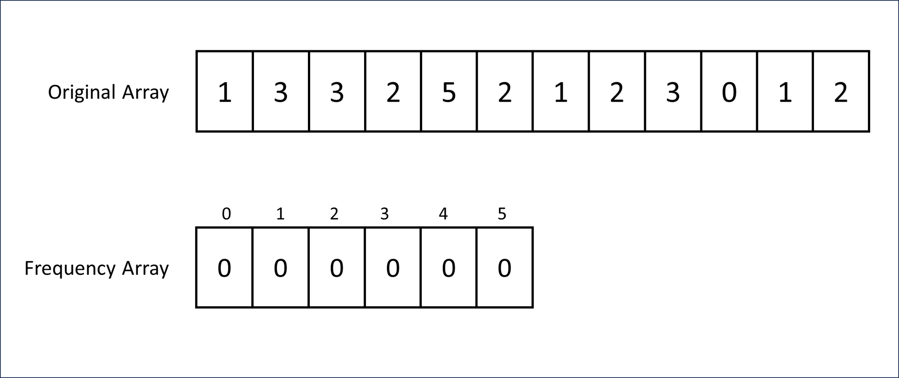
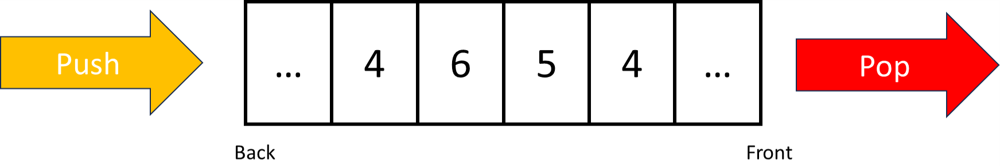
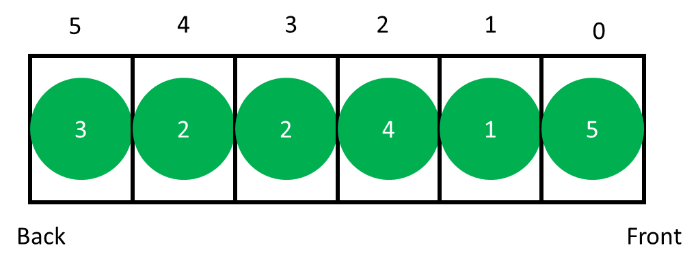
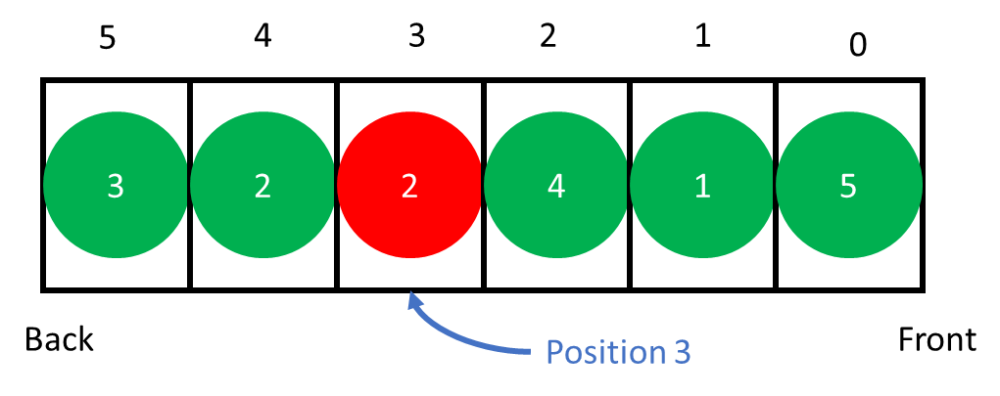
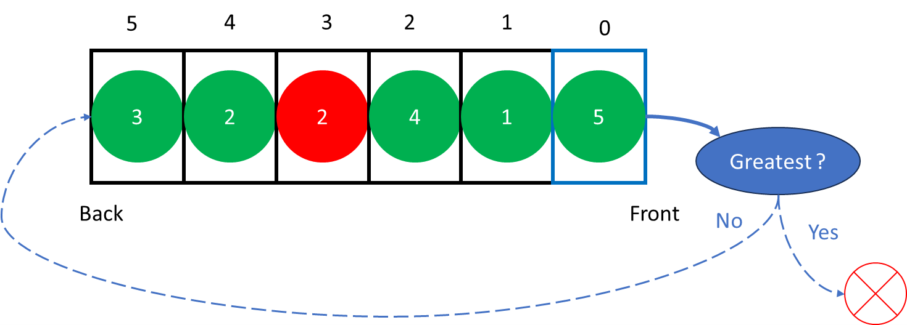

# Session Plan


# problems
## problem : Bars


## Problem : UVA 12100
Each paper in the queue has a priority (1 to 9).
Your paper is initially the m'th paper in the queue.
A paper is poped from the queue
if     :    there is no paper in the queue with a higher priority, print it (Takes 1 min).
Else   :    push the paper at the end back of the queue.
What is the time needed for your paper to get printed?
<br>
### concepts :
1- frequency  array
<br>
2- queue (front/back , push/pop)
<br>
3- problem idea
<br>
#### frequency  array :
the main goal is to count the apperance of the values in the original array.
<br>
so it can be done if the range of the values in the original array is known.
ex: the values is (0 < x < 5) 

the preperation of the frequency array can be done by iterate the values of the original array `arr[i]` <br>
and increment the value of the index x in the frequency array `freq[x]` where x in the element in the original array .<br>
in other form : `freq[arr[i]]`
<br>
### queue
the Queue push the elements (add it) from the back.<br>
the Queue pop the elements (delete it) from the front.<br><br>

<br>
### problem idea
the initial situation is that we have an queue of cards.<br>
each card have a priority (value).<br>
we fill it with the given priorities (fill the queue with values).<br>

<br>
also we are given an important card position (index).<br>

<br>
we have some steps to follow ...<br>
look at the card which is to be poped (شوف الكارت اللي عليها الدور انها تتشال  ) <br>
if it is the greatest priority -> pop it .<br>
it it's not -> push it again to the back.<br>
Note that : the Poping process takes one unit of time.<br>

**the Question is :** how long whould it take to pop the importatn card ? <br>



### code
```cpp
int f[10];
int main()
{
    cin.tie(0);
    cin.sync_with_stdio(0);
    #ifndef ONLINE_JUDGE
    freopen("input.txt", "r", stdin);
    #endif // ONLINE_JUDGE
    int T;  cin >> T;
    while(T--)
    {
        memset(f, 0, sizeof(f));
        int n, pos; cin >> n >> pos;
        queue<int> q;
        for(int i=0;i<n;i++)
        {
            int p; cin >> p;
            q.push(p);
            f[p] ++;
        } 
        int highest = 9;
        int time = 0;
        while(1)
        {
            while(f[highest] == 0) highest --;
            int p = q.front();    q.pop();
            if(p == highest){
                time ++;
                f[p] --;
                if(pos == 0)  break;
                else pos--;
            }else{
                q.push(p);
                if(pos == 0)  pos = q.size()-1;
                else pos--;
            }
        }
        cout << time << endl;
    }
    return 0;
}
```
