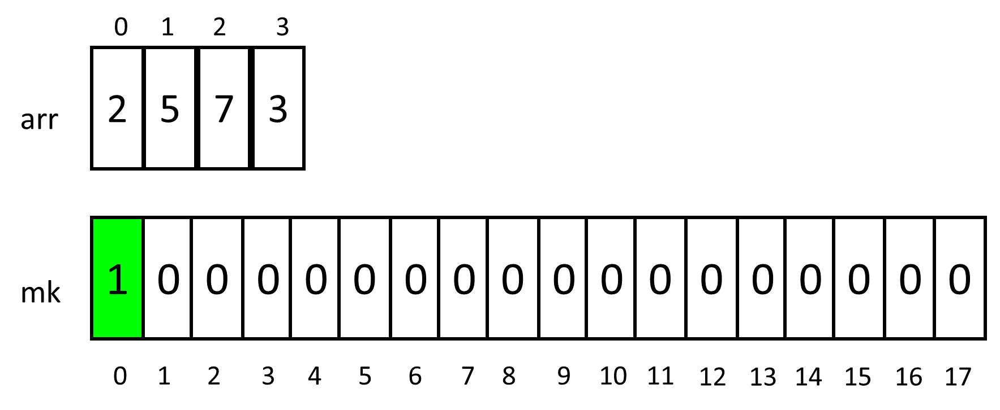
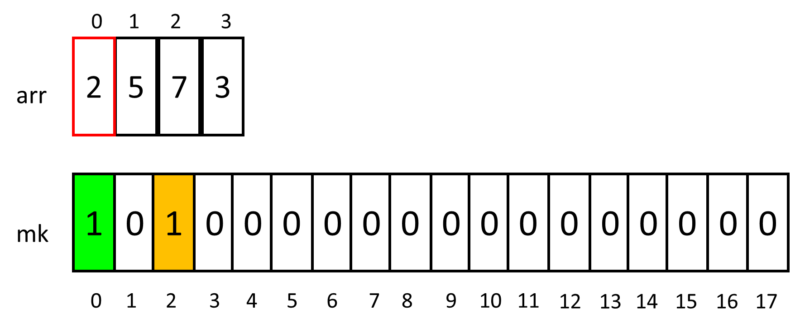
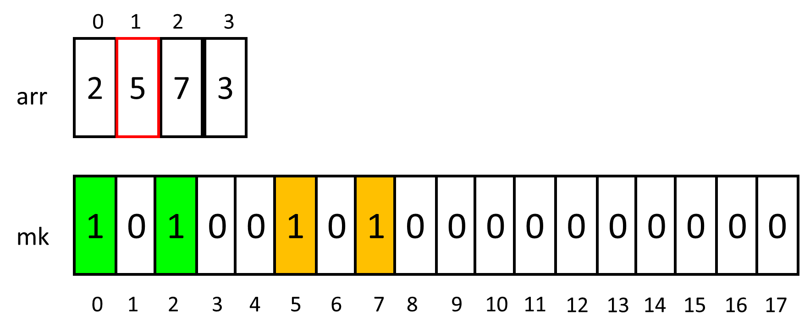
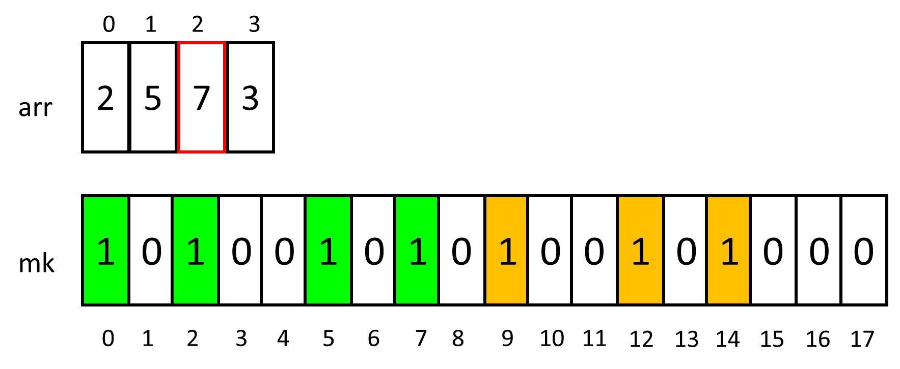
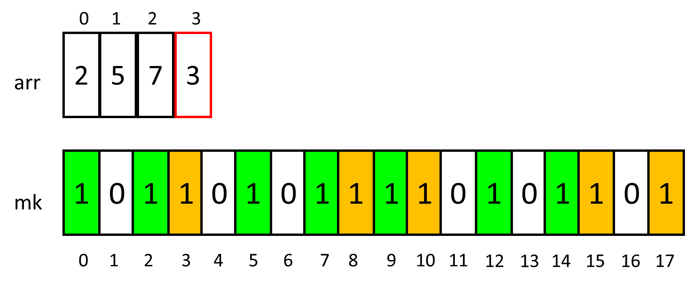

# Session Plan


# problems
## problem : Bars ([UVA 12455](https://vjudge.net/problem/UVA-12455))
> We have some metallic bars, theirs length known (represented by `p` numbers - aka : `arr` array ) <br>
> if necessary, we want to solder some of them in order to obtain another one being exactly a given length long. (represented by `n` )
> No bar can be cut up. Is it possible?

### general solution :
create a set of all possible values resulted from adding x numbers from the  `arr` array  (where : 0 <= x <= p )<br>
if `n` is in this set : print `Yes` otherwise print `No` <br>

### explanation :
all possible values : <br>
assume the `arr` array is `[ 1 , 2 , 4 ]`<br>
the set of all possible values is : `[ 0 , 1, 2, 4, 3, 6, 5, 7 ] `<br>
so ... <br> 
if the wanted value is in this set : print `Yes` <br> 
else :  print `No` <br> 

### technique :
as the maximum value of the wanted `n` is 1000 , create a `boolean` array (named for example : 'mk') of 1001 size and initialise it with `false`.<br>
`mk` will represent all possible values that might exist for 'n' <br>
set `0` index with true (as it is shared between all possible sets )<br>
iterate the `arr` array and for each `arr[i]` : 
  iterate the `mk` array and mark `mk[j]` by setting it to `true` , only if : <br>
1- `j = 0 + arr[i]` <br>
2- `j = k + arr[i]` where `mk[k] == true`<br>
<br>
if `mk[n]` is `true` : print `Yes` <br> 
else :  print `No` <br> 

### implementation (on paper) :
example `arr= [2,5,7,8]`
#### loop (0) : 
  <br>
#### loop (1) : 
  <br>
#### loop (2) : 
  <br>
#### loop (3) : 
  <br>
#### loop (4) : 
  <br>

## problem : Desorting ([1853A](https://codeforces.com/problemset/problem/1853/A))
> given an array , allowed to perform one type of operation on it (zero or more times):<br>
> choose an element of index i , add 1 to all elements of index j (0<j<=i)<br>
> subtract 1 from all elements of index k (i<k)
> what is the minimum number of operations required to make this array NOT sorted 

### steps :
1- make sure that the array is sorted (if not : the answer is 0)<br>
2- search for two elements where the differance between them is minimum<br>
3- the answer = (differance / 2) + 1<br>

## Problem : Printer Queue ([UVA 12100](https://vjudge.net/problem/UVA-12100))
> Each paper in the queue has a priority (1 to 9).<br>
>Your paper is initially the m'th paper in the queue.<br>
>A paper is poped from the queue<br>
>if     :    there is no paper in the queue with a higher priority, print it (Takes 1 min).<br>
>Else   :    push the paper at the end back of the queue.<br>
>What is the time needed for your paper to get printed?<br>

### concepts :
1- frequency  array
<br>
2- queue (front/back , push/pop)
<br>
3- problem idea
<br>
#### frequency  array :
the main goal is to count the apperance of the values in the original array.<br>
  <br>
so it can be done if the range of the values in the original array is known.<br>
ex: the values is (0 < x < 5) <br>
  <br>
the preperation of the frequency array can be done by iterate the values of the original array `arr[i]` <br>
and increment the value of the index x in the frequency array `freq[x]` where x in the element in the original array .<br>
in other form : `freq[arr[i]]`
<br>
### queue
the Queue push the elements (add it) from the back.<br>
the Queue pop the elements (delete it) from the front.<br><br>
  
<br>
### problem idea
the initial situation is that we have an queue of cards.<br>
each card have a priority (value).<br>
we fill it with the given priorities (fill the queue with values).<br>
  
<br>
also we are given an important card position (index).<br>

  
we have some steps to follow ...<br>
look at the card which is to be poped (شوف الكارت اللي عليها الدور انها تتشال  ) <br>
if it is the greatest priority -> pop it .<br>
it it's not -> push it again to the back.<br>
Note that : the Poping process takes one unit of time.<br>

**the Question is :** how long whould it take to pop the importatn card ? <br>
  

### code
```cpp
int f[10];
int main()
{
    cin.tie(0);
    cin.sync_with_stdio(0);
    #ifndef ONLINE_JUDGE
    freopen("input.txt", "r", stdin);
    #endif // ONLINE_JUDGE
    int T;  cin >> T;
    while(T--)
    {
        memset(f, 0, sizeof(f));
        int n, pos; cin >> n >> pos;
        queue<int> q;
        for(int i=0;i<n;i++)
        {
            int p; cin >> p;
            q.push(p);
            f[p] ++;
        } 
        int highest = 9;
        int time = 0;
        while(1)
        {
            while(f[highest] == 0) highest --;
            int p = q.front();    q.pop();
            if(p == highest){
                time ++;
                f[p] --;
                if(pos == 0)  break;
                else pos--;
            }else{
                q.push(p);
                if(pos == 0)  pos = q.size()-1;
                else pos--;
            }
        }
        cout << time << endl;
    }
    return 0;
}
```
